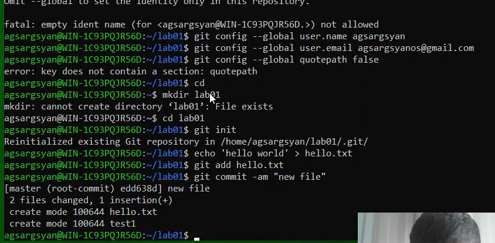
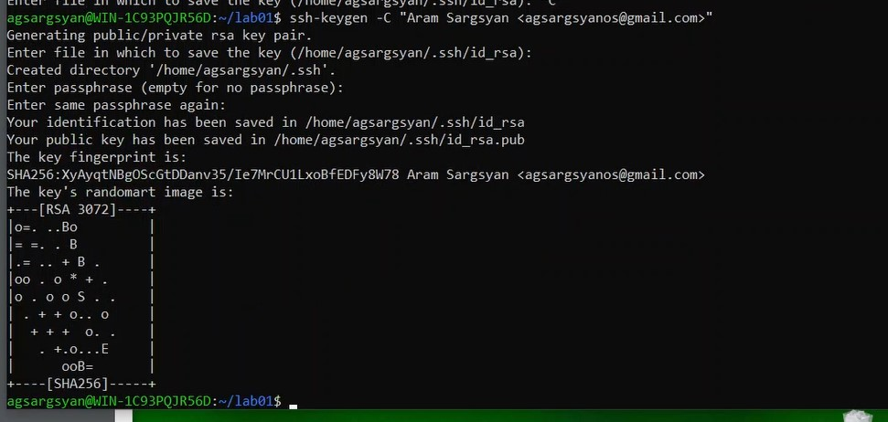

---
## Front matter
lang: ru-RU
title: Презентация по лабораторной работе №1
subtitle: 
author:
  - Саргсян А. Г.
institute:
  - Российский университет дружбы народов, Москва, Россия
date: 14 сентября 2024

## i18n babel
babel-lang: russian
babel-otherlangs: english

## Formatting pdf
toc: false
toc-title: Содержание
slide_level: 2
aspectratio: 169
section-titles: true
theme: metropolis
header-includes:
 - \metroset{progressbar=frametitle,sectionpage=progressbar,numbering=fraction}
---

# Цель работы 

## Цели и задачи работы
Цели:

- Изучить идеологию и применение средств контроля версий.
- Освоить умения по работе с git.

Задачи:

- Создать базовую конфигурацию для работы с git.
- Создать ключ SSH.
- Создать ключ PGP.
- Настроить подписи git.
- Зарегистрироваться на Github.
- Создать локальный каталог для выполнения заданий по предмету.

# Ход работы

## Работа с git в консоли

{#fig:002 width=70%}

## Создание ssh-ключа

{#fig:003 width=70%}

# Выводы

## Выводы

Я установил рабочее пространство и получил навыки для работы с git.