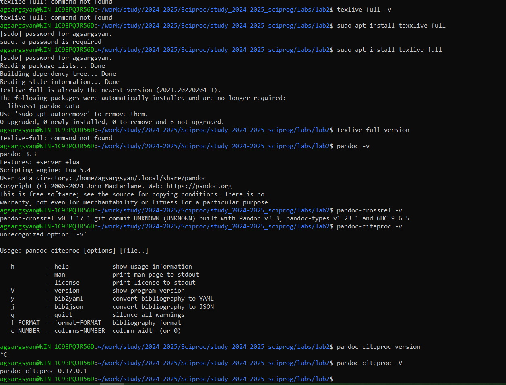

---
## Front matter
title: "Шаблон отчёта по лабораторной работе 2"
subtitle: "Markdown"
author: "Арам Грачьяевич Саргсян"

## Generic otions
lang: ru-RU
toc-title: "Содержание"

## Bibliography
bibliography: bib/cite.bib
csl: pandoc/csl/gost-r-7-0-5-2008-numeric.csl

## Pdf output format
toc: true # Table of contents
toc-depth: 2
lof: true # List of figures
lot: true # List of tables
fontsize: 12pt
linestretch: 1.5
papersize: a4
documentclass: scrreprt
## I18n polyglossia
polyglossia-lang:
  name: russian
  options:
	- spelling=modern
	- babelshorthands=true
polyglossia-otherlangs:
  name: english
## I18n babel
babel-lang: russian
babel-otherlangs: english
## Fonts
mainfont: IBM Plex Serif
romanfont: IBM Plex Serif
sansfont: IBM Plex Sans
monofont: IBM Plex Mono
mathfont: STIX Two Math
mainfontoptions: Ligatures=Common,Ligatures=TeX,Scale=0.94
romanfontoptions: Ligatures=Common,Ligatures=TeX,Scale=0.94
sansfontoptions: Ligatures=Common,Ligatures=TeX,Scale=MatchLowercase,Scale=0.94
monofontoptions: Scale=MatchLowercase,Scale=0.94,FakeStretch=0.9
mathfontoptions:
## Biblatex
biblatex: true
biblio-style: "gost-numeric"
biblatexoptions:
  - parentracker=true
  - backend=biber
  - hyperref=auto
  - language=auto
  - autolang=other*
  - citestyle=gost-numeric
## Pandoc-crossref LaTeX customization
figureTitle: "Рис."
tableTitle: "Таблица"
listingTitle: "Листинг"
lofTitle: "Список иллюстраций"
lotTitle: "Список таблиц"
lolTitle: "Листинги"
## Misc options
indent: true
header-includes:
  - \usepackage{indentfirst}
  - \usepackage{float} # keep figures where there are in the text
  - \floatplacement{figure}{H} # keep figures where there are in the text
---

# Цель работы

Научиться оформлять отчёты с помощью легковесного языка разметки Markdown.

# Задание

- Познакомиться с языком разметки Markdown
- Сделать отчет по лабораторной работе на Markdown

# Теоретическое введение

Markdown — это облегчённый язык разметки, созданный с целью обозначения форматирования в простом тексте, 
с максимальным сохранением его читаемости человеком, и пригодный для машинного преобразования в 
языки для продвинутых публикаций (HTML, Rich Text и других).


# Выполнение лабораторной работы

1. Я установил все утилиты для конвертирования Markdown в docx и pdf (рис. [-@fig:001]).

{#fig:001 width=70%}

2. Познакомился с основным синтаксисом, разобрался со ставками формул. 

- H~2~O — формула воды

- $\sin^2 (x) + \cos^2 (x) = 1$ — математическая формула

- ***Разное*** *выделение* **текста**.

- > Be or not to be

- ```print('Hello world')```

# Выводы

Я научился оформлять отчёты с помощью легковесного языка разметки Markdown.

# Список литературы{.unnumbered}

1. [Язык разметки Markdown](https://doka.guide/tools/markdown/)

2. [Репозиторий курса](https://github.com/agsargsyan/study_2024-2025_sciprog)
