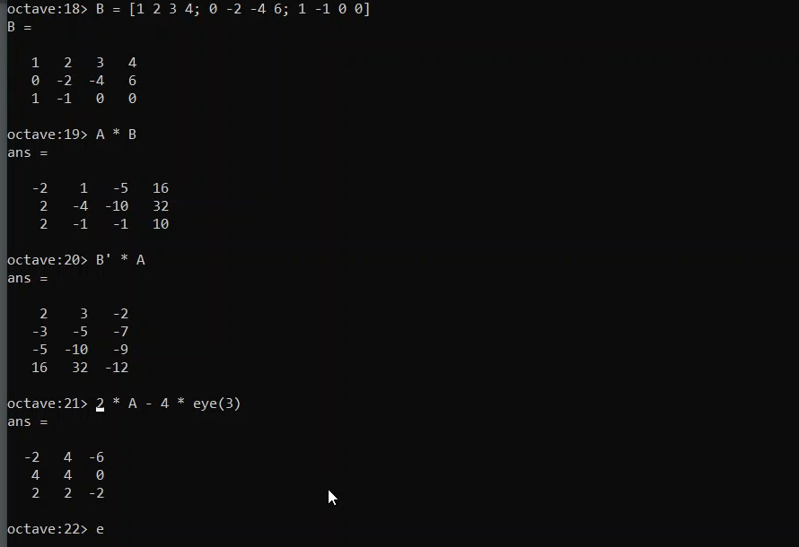
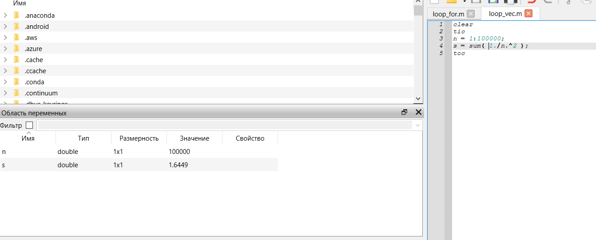

---
## Front matter
lang: ru-RU
title: Презентация по лабораторной работе №3
subtitle: Введение в работу с Octave
author:
  - Саргсян А. Г.
institute:
  - Российский университет дружбы народов, Москва, Россия
date: 08 октября 2024

## i18n babel
babel-lang: russian
babel-otherlangs: english

## Formatting pdf
toc: false
toc-title: Содержание
slide_level: 2
aspectratio: 169
section-titles: true
theme: metropolis
header-includes:
 - \metroset{progressbar=frametitle,sectionpage=progressbar,numbering=fraction}
---

## Цели и задачи работы

Цель:

Освоить базовые навыки работы в Octave.

Задачи:

- Установить на свое устройство Octave
- Познакомиться с простыми задачами и синтаксисом

## Операции с матрицами

{#fig:003 width=70%}

## Работа в GUI

{#fig:007 width=70%}

## Выводы

Я освоил базовые навыки работы в Octave.