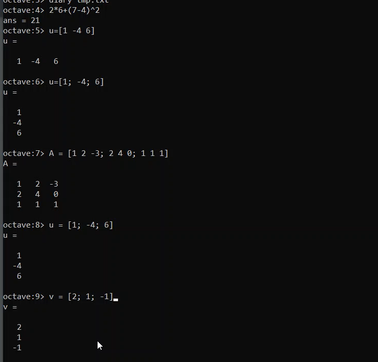
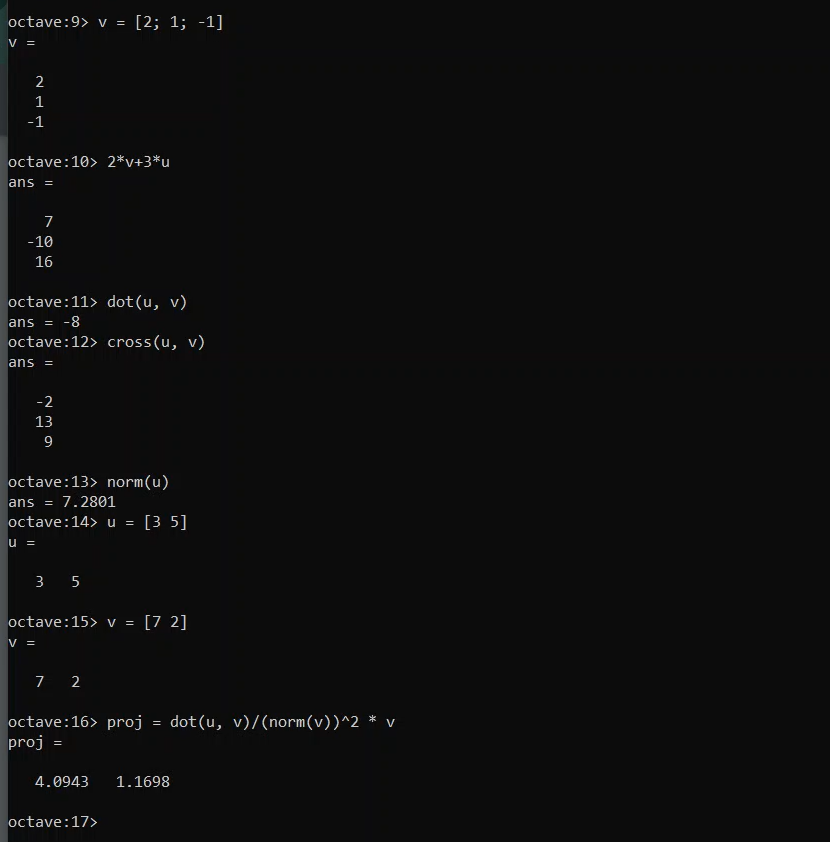
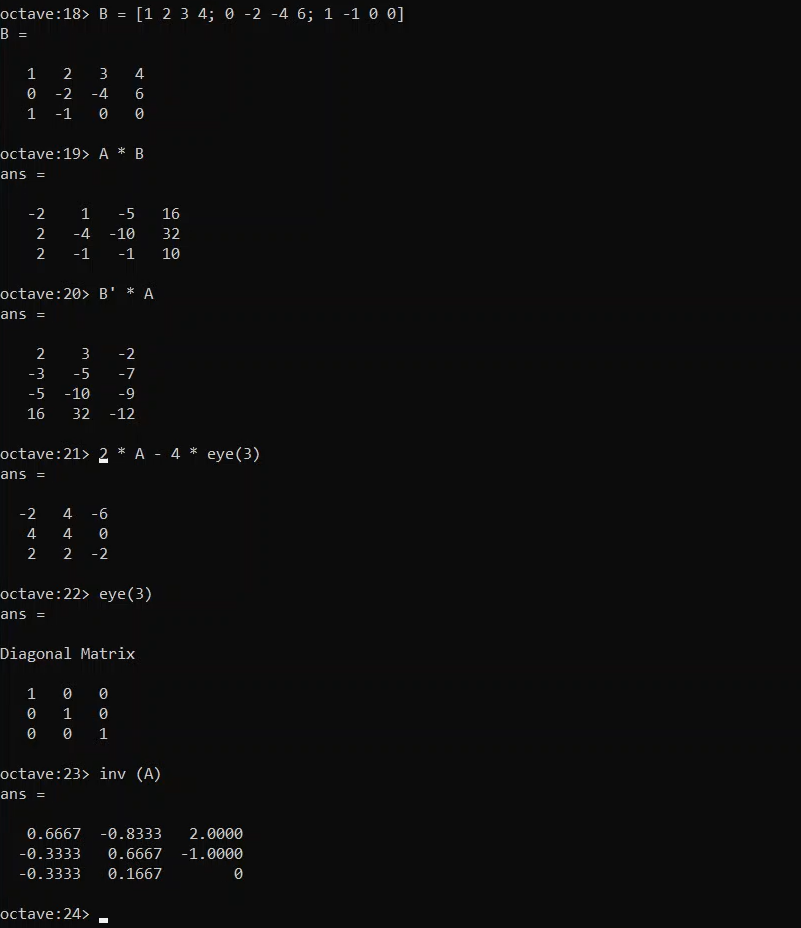
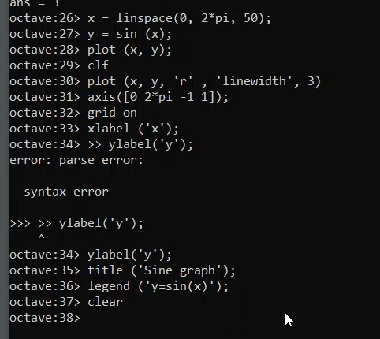
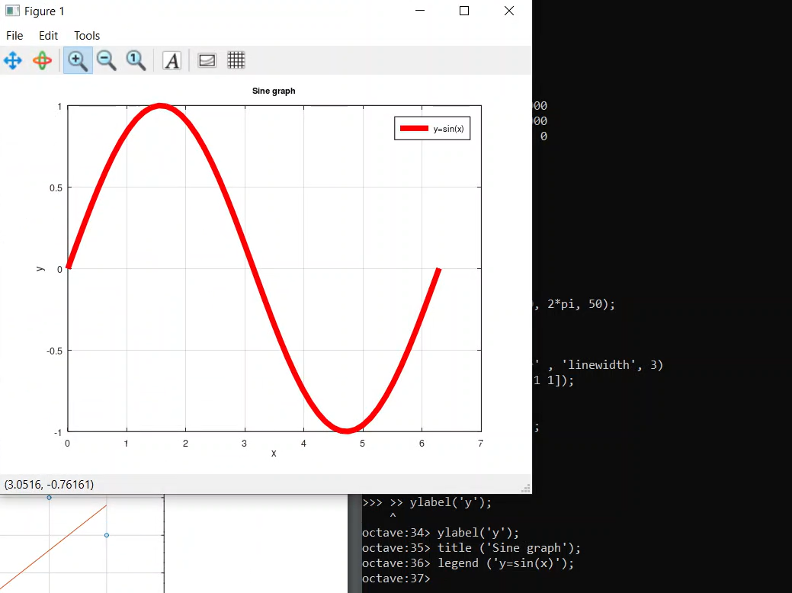
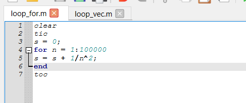
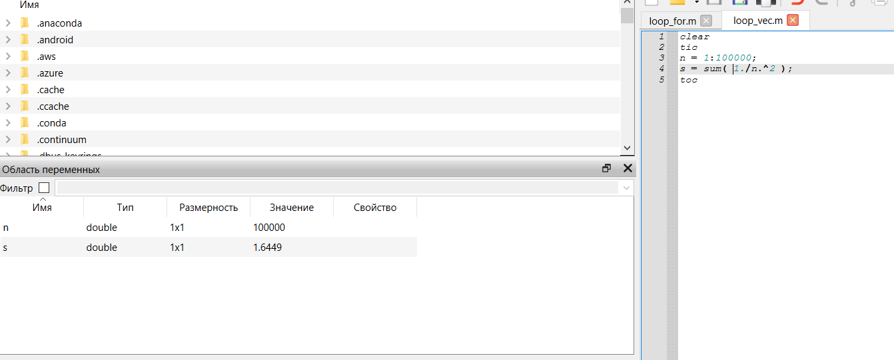

---
## Front matter
title: "Отчет по лабораторной работе №3"
subtitle: "Введение в работу с Octave"
author: "Арам Грачьяевич Саргсян"

## Generic otions
lang: ru-RU
toc-title: "Содержание"

## Bibliography
bibliography: bib/cite.bib
csl: pandoc/csl/gost-r-7-0-5-2008-numeric.csl

## Pdf output format
toc: true # Table of contents
toc-depth: 2
lof: true # List of figures
lot: false # List of tables
fontsize: 12pt
linestretch: 1.5
papersize: a4
documentclass: scrreprt
## I18n polyglossia
polyglossia-lang:
  name: russian
  options:
	- spelling=modern
	- babelshorthands=true
polyglossia-otherlangs:
  name: english
## I18n babel
babel-lang: russian
babel-otherlangs: english
## Fonts
mainfont: IBM Plex Serif
romanfont: IBM Plex Serif
sansfont: IBM Plex Sans
monofont: IBM Plex Mono
mathfont: STIX Two Math
mainfontoptions: Ligatures=Common,Ligatures=TeX,Scale=0.94
romanfontoptions: Ligatures=Common,Ligatures=TeX,Scale=0.94
sansfontoptions: Ligatures=Common,Ligatures=TeX,Scale=MatchLowercase,Scale=0.94
monofontoptions: Scale=MatchLowercase,Scale=0.94,FakeStretch=0.9
mathfontoptions:
## Biblatex
biblatex: true
biblio-style: "gost-numeric"
biblatexoptions:
  - parentracker=true
  - backend=biber
  - hyperref=auto
  - language=auto
  - autolang=other*
  - citestyle=gost-numeric
## Pandoc-crossref LaTeX customization
figureTitle: "Рис."
tableTitle: "Таблица"
listingTitle: "Листинг"
lofTitle: "Список иллюстраций"
lotTitle: "Список таблиц"
lolTitle: "Листинги"
## Misc options
indent: true
header-includes:
  - \usepackage{indentfirst}
  - \usepackage{float} # keep figures where there are in the text
  - \floatplacement{figure}{H} # keep figures where there are in the text
---

# Цель работы

Освоить базовые навыки работы в Octave.
# Теоретическое введение

Octave — высокоуровневый интерпретируемый язык программирования, предназначенный для решения задач вычислительной математики. 
По возможностям и качеству реализации Octave похож на MATLAB. 
В состав пакета входит интерактивный командный интерфейс, который запускается из терминала ОС Linux или из его порта в Windows. 
После запуска Octave пользователь видит окно интерпретатора. 

Octave имеет большое количество инструментов для решения распространенных задач числовой линейной алгебры, поиска корней нелинейных уравнений, 
интегрирования обычных функций, управления полиномами, интегрирования обыкновенных дифференциальных и дифференциально-алгебраических уравнений и т.д. 
Также в Octave можно рисовать графики. Функционал этой программной системы может быть легко расширен и перенастроен с помощью пользовательских функций, 
написанных на собственном языке программирования Octave, либо с помощью динамически загружаемых модулей, написанных на C++, C, Fortran или других языках.

# Выполнение лабораторной работы

1. Я изучил методы работы с числами, векторами и матрицами (рис. @fig:001, @fig:002, @fig:003).

{#fig:001 width=70%}

{#fig:002 width=70%}

{#fig:003 width=70%}

2. Я изучил методы работы с графиками функций (рис. @fig:004, @fig:005).

{#fig:004 width=70%}

{#fig:005 width=70%}

3. Я изучил работу с циклами (рис. @fig:006, @fig:007).

{#fig:006 width=70%}

{#fig:007 width=70%}

# Выводы

Я освоил базовые навыки работы в Octave.

