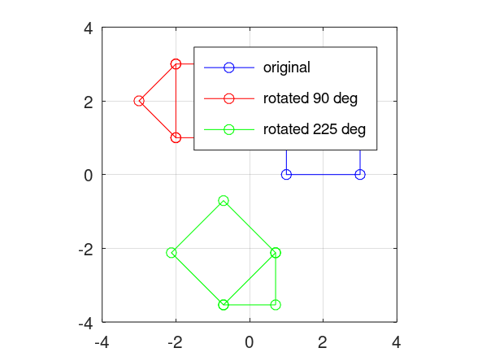
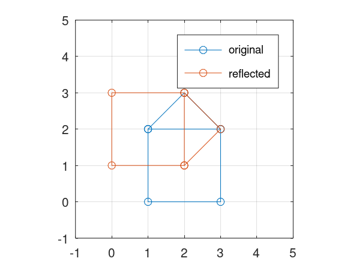
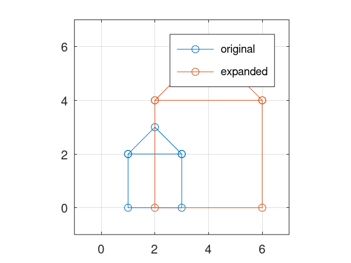

---
## Front matter
title: "Отчета по лабораторной работе №5"
author: "Арам Грачьяевич Саргсян"

## Generic otions
lang: ru-RU
toc-title: "Содержание"

## Bibliography
bibliography: bib/cite.bib
csl: pandoc/csl/gost-r-7-0-5-2008-numeric.csl

## Pdf output format
toc: true # Table of contents
toc-depth: 2
lof: true # List of figures
lot: true # List of tables
fontsize: 12pt
linestretch: 1.5
papersize: a4
documentclass: scrreprt
## I18n polyglossia
polyglossia-lang:
  name: russian
  options:
	- spelling=modern
	- babelshorthands=true
polyglossia-otherlangs:
  name: english
## I18n babel
babel-lang: russian
babel-otherlangs: english
## Fonts
mainfont: IBM Plex Serif
romanfont: IBM Plex Serif
sansfont: IBM Plex Sans
monofont: IBM Plex Mono
mathfont: STIX Two Math
mainfontoptions: Ligatures=Common,Ligatures=TeX,Scale=0.94
romanfontoptions: Ligatures=Common,Ligatures=TeX,Scale=0.94
sansfontoptions: Ligatures=Common,Ligatures=TeX,Scale=MatchLowercase,Scale=0.94
monofontoptions: Scale=MatchLowercase,Scale=0.94,FakeStretch=0.9
mathfontoptions:
## Biblatex
biblatex: true
biblio-style: "gost-numeric"
biblatexoptions:
  - parentracker=true
  - backend=biber
  - hyperref=auto
  - language=auto
  - autolang=other*
  - citestyle=gost-numeric
## Pandoc-crossref LaTeX customization
figureTitle: "Рис."
tableTitle: "Таблица"
listingTitle: "Листинг"
lofTitle: "Список иллюстраций"
lotTitle: "Список таблиц"
lolTitle: "Листинги"
## Misc options
indent: true
header-includes:
  - \usepackage{indentfirst}
  - \usepackage{float} # keep figures where there are in the text
  - \floatplacement{figure}{H} # keep figures where there are in the text
---

# Цель работы

Освоить алгоритмы 

# Теоретическое введение

## Метод Гаусс

Запишем исходную систему

$$
 \begin{cases}
   a_{1}^{1}x^{1}+...+ a_{n}^{1}x^{n} = b^{1} \\
   ... \\
   a_{1}^{m}x^{1}+...+ a_{n}^{m}x^{n} = b^{m}
 \end{cases}
$$

в матричном виде: $Ax=b$. Матрица A называется основной матрицей системы, b — столбцом свободных членов. 
Алгоритм решения СЛАУ методом Гаусса подразделяется на два этапа:

- на первом этапе осуществляется так называемый прямой ход, когда путём элементарных преобразований над строками 
систему приводят к ступенчатой или треугольной форме, либо устанавливают, что система несовместна;

- на втором этапе осуществляется так называемый обратный ход, суть которого заключается в том, чтобы выразить 
все получившиеся базисные переменные через небазисные и построить фундаментальную систему решений, либо, если все 
переменные являются базисными, то выразить в численном виде единственное решение системы линейных уравнений.

Для приведения матрицы к треугольному виду для системы уравнений $Ax=b$ используют расширенную матрицу.


# Выполнение лабораторной работы

1. Я выполнил все дейсвия с подгонкой полиномиальной кривой и матричными преобразованиями.

```
octave:2> D = [ 1 1 ; 2 2 ; 3 5 ; 4 4 ; 5 2 ; 6 -3]
D =

   1   1
   2   2
   3   5
   4   4
   5   2
   6  -3

octave:3> xdata = D(:,1)
xdata =

   1
   2
   3
   4
   5
   6

octave:4> ydata = D(:,2)
ydata =

   1
   2
   5
   4
   2
  -3

octave:5> plot(xdata,ydata,'o-')
octave:6>  A = ones(6,3)
A =

   1   1   1
   1   1   1
   1   1   1
   1   1   1
   1   1   1
   1   1   1

octave:7> A(:,1) = xdata .^ 2
A =

    1    1    1
    4    1    1
    9    1    1
   16    1    1
   25    1    1
   36    1    1

octave:8>  A(:,2) = xdata
A =

    1    1    1
    4    2    1
    9    3    1
   16    4    1
   25    5    1
   36    6    1

octave:9> A'*A
ans =

   2275    441     91
    441     91     21
     91     21      6

octave:10> A' * ydata
ans =

   60
   28
   11

octave:11> B = A' * A;
octave:12> B (:,4) = A' * ydata;
octave:13> B_res = rref (B)
B_res =

   1.0000        0        0  -0.8929
        0   1.0000        0   5.6500
        0        0   1.0000  -4.4000

octave:14> a1=B_res(1,4)
a1 = -0.8929
octave:15> a2=B_res(2,4)
a2 = 5.6500
octave:16> a3=B_res(3,4)
a3 = -4.4000
octave:17> x = linspace (0,7,50);
octave:18> y = a1 * x .^ 2 + a2 * x + a3;
octave:19> plot (xdata,ydata, 'o' ,x,y, 'linewidth', 2)
octave:20> grid on;
octave:21>  legend ('data values', 'least-squares parabola')
octave:22> title ('y = -0.89286 x^2 + 5.65 x - 4.4')
octave:23> P = polyfit (xdata, ydata, 2)
P =

  -0.8929   5.6500  -4.4000

octave:24> y = polyval (P,xdata)
y =

   0.3571
   3.3286
   4.5143
   3.9143
   1.5286
  -2.6429

octave:25> plot(xdata,ydata,'o-',xdata,y,'+-')
octave:26> grid on;
octave:27>  legend ('original data' , 'polyfit data' ) ;
octave:28> D = [ 1 1 3 3 2 1 3 ; 2 0 0 2 3 2 2 ]
D =

   1   1   3   3   2   1   3
   2   0   0   2   3   2   2

octave:29> x = D(1,:)
x =

   1   1   3   3   2   1   3

octave:30>  y = D(2,:)
y =

   2   0   0   2   3   2   2

octave:31> plot (x,y)
octave:32> theta1 = 90*pi/180
theta1 = 1.5708
octave:33> R1 = [cos(theta1) -sin(theta1); sin(theta1) cos(theta1)]
R1 =

   6.1230e-17  -1.0000e+00
   1.0000e+00   6.1230e-17

octave:34> RD1 = R1*D
RD1 =

  -2.0000e+00   6.1230e-17   1.8369e-16  -2.0000e+00  -3.0000e+00  -2.0000e+00  -2.0000e+00
   1.0000e+00   1.0000e+00   3.0000e+00   3.0000e+00   2.0000e+00   1.0000e+00   3.0000e+00

octave:35> x1 = RD1(1,:)
x1 =

  -2.0000e+00   6.1230e-17   1.8369e-16  -2.0000e+00  -3.0000e+00  -2.0000e+00  -2.0000e+00

octave:36> y1 = RD1(2,:)
y1 =

   1   1   3   3   2   1   3

octave:37> theta2 = 225*pi/180
theta2 = 3.9270
octave:38>  R2 = [cos(theta2) -sin(theta2); sin(theta2) cos(theta2)]
R2 =

  -0.7071   0.7071
  -0.7071  -0.7071

octave:39> RD2 = R2*D
RD2 =

   0.7071  -0.7071  -2.1213  -0.7071   0.7071   0.7071  -0.7071
  -2.1213  -0.7071  -2.1213  -3.5355  -3.5355  -2.1213  -3.5355

octave:40> x2 = RD2(1,:)
x2 =

   0.7071  -0.7071  -2.1213  -0.7071   0.7071   0.7071  -0.7071

octave:41> y2 = RD2(2,:)
y2 =

  -2.1213  -0.7071  -2.1213  -3.5355  -3.5355  -2.1213  -3.5355

octave:42> plot (x,y, 'bo-' , x1 , y1 , 'ro-' , x2 , y2 , 'go-' )
octave:43> axis ([-4 4 -4 4] , 'equal' ) ;
octave:44> grid on;
octave:45> legend ('original' , 'rotated 90 deg' , 'rotated 225 deg' ) ;
octave:46>  R = [0 1; 1 0]
R =

   0   1
   1   0

octave:47>  RD = R * D
RD =

   2   0   0   2   3   2   2
   1   1   3   3   2   1   3

octave:48> x1 = RD(1,:)
x1 =

   2   0   0   2   3   2   2

octave:49>  y1 = RD(2,:)
y1 =

   1   1   3   3   2   1   3

octave:50> plot (x,y,'o-',x1,y1,'o-')
octave:51> axis([-1 4 -1 4], 'equal');
octave:52> axis([-1 5 -1 5], 'equal');
octave:53> grid on ;
octave:54>  legend ( 'original' , 'reflected' )
octave:55>  T = [2 0; 0 2]
T =

   2   0
   0   2

octave:56>  TD = T*D;
octave:57> x1 = TD(1,:); y1 = TD(2,:);
octave:58>  plot (x, y, 'o-', x1, y1,'o-')
octave:59> 
octave:59> axis ([-1 7 -1 7], 'equal');
octave:60> grid on;
octave:61> legend ('original', 'expanded')
octave:62> diary off;

```

2. Получил все необходимые графики (рис. @fig:001, @fig:002, @fig:003, @fig:004).

{#fig:001 width=70%}

{#fig:002 width=70%}

{#fig:003 width=70%}

{#fig:004 width=70%}


# Выводы

Я изучил все представленные алгоритмы для преобразований.