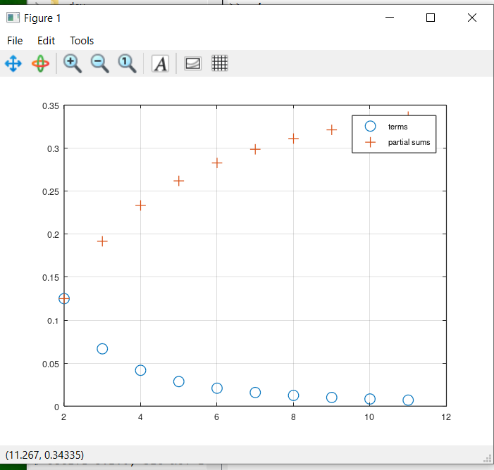

---
## Front matter
title: "Отчета по лабораторной работе №6"
author: "Арам Грачьяевич Саргсян"

## Generic otions
lang: ru-RU
toc-title: "Содержание"

## Bibliography
bibliography: bib/cite.bib
csl: pandoc/csl/gost-r-7-0-5-2008-numeric.csl

## Pdf output format
toc: true # Table of contents
toc-depth: 2
lof: true # List of figures
lot: true # List of tables
fontsize: 12pt
linestretch: 1.5
papersize: a4
documentclass: scrreprt
## I18n polyglossia
polyglossia-lang:
  name: russian
  options:
	- spelling=modern
	- babelshorthands=true
polyglossia-otherlangs:
  name: english
## I18n babel
babel-lang: russian
babel-otherlangs: english
## Fonts
mainfont: IBM Plex Serif
romanfont: IBM Plex Serif
sansfont: IBM Plex Sans
monofont: IBM Plex Mono
mathfont: STIX Two Math
mainfontoptions: Ligatures=Common,Ligatures=TeX,Scale=0.94
romanfontoptions: Ligatures=Common,Ligatures=TeX,Scale=0.94
sansfontoptions: Ligatures=Common,Ligatures=TeX,Scale=MatchLowercase,Scale=0.94
monofontoptions: Scale=MatchLowercase,Scale=0.94,FakeStretch=0.9
mathfontoptions:
## Biblatex
biblatex: true
biblio-style: "gost-numeric"
biblatexoptions:
  - parentracker=true
  - backend=biber
  - hyperref=auto
  - language=auto
  - autolang=other*
  - citestyle=gost-numeric
## Pandoc-crossref LaTeX customization
figureTitle: "Рис."
tableTitle: "Таблица"
listingTitle: "Листинг"
lofTitle: "Список иллюстраций"
lotTitle: "Список таблиц"
lolTitle: "Листинги"
## Misc options
indent: true
header-includes:
  - \usepackage{indentfirst}
  - \usepackage{float} # keep figures where there are in the text
  - \floatplacement{figure}{H} # keep figures where there are in the text
---

# Цель работы

Освоить алгоритмы работы с интегралов.


# Выполнение лабораторной работы

1. Я выполнил все дейсвия с подгонкой полиномиальной кривой и матричными преобразованиями.

```
>> f = @(n) (1 + 1 ./ n) .^ n
f =

@(n) (1 + 1 ./ n) .^ n

>> k = [0:1:9]'
k =

   0
   1
   2
   3
   4
   5
   6
   7
   8
   9

>> format long
>> n = 10 .^ k
n =

            1
           10
          100
         1000
        10000
       100000
      1000000
     10000000
    100000000
   1000000000

>> f (n)
ans =

   2.000000000000000
   2.593742460100002
   2.704813829421529
   2.716923932235520
   2.718145926824356
   2.718268237197528
   2.718280469156428
   2.718281693980372
   2.718281786395798
   2.718282030814509

>> format
>> n = [2:1:11]';
>> a = 1 ./ (n .* (n+2))
a =

   1.2500e-01
   6.6667e-02
   4.1667e-02
   2.8571e-02
   2.0833e-02
   1.5873e-02
   1.2500e-02
   1.0101e-02
   8.3333e-03
   6.9930e-03

>> for i = 1:10
s (i) = sum(a(1:i));
end
>> s'
ans =

   0.1250
   0.1917
   0.2333
   0.2619
   0.2827
   0.2986
   0.3111
   0.3212
   0.3295
   0.3365

>> plot (n,a,'o',n,s,'+')
>> grid on
>> legend('terms', 'partial sums')
>> n = [1:1:1000];
>> a = 1 ./ n;
>> sum(a)
ans = 7.4855
>> function y = f(x)
y = exp (x .^ 2) .* cos (x);
end
>> quad ('f',0,pi/2)
ans = 1.8757
>> diary off

```

2. Получил все необходимые графики (рис. @fig:001).

{#fig:001 width=70%}


# Выводы

Я изучил все представленные алгоритмы для интегралов.